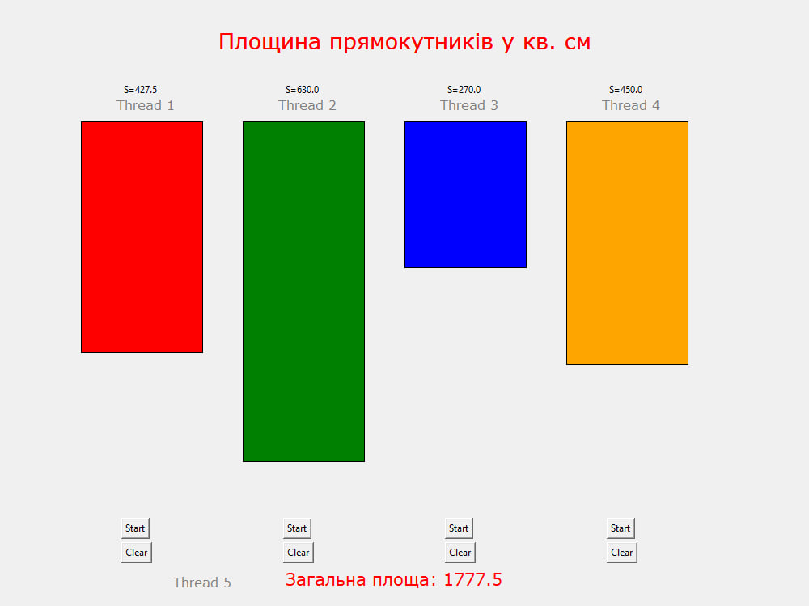

  
  <h2 align="center">Threads</h2>

<h2>
⚜️Глянь як працюють потоки в процесі⚜️
</h2>
<table>
  <td>
    
  </td>
  <td>
    <h3>Ця програма демонструє роботу 4 прямокутників 
      які змінюються за розмірами та над кожним з них 
      є їхні площі. Кожен прямокутник це поток,загальна 
      площа теж окремий поток. Знизу продемонстровано  загальну 
      площу та зображено кнопки «Start»- для старту потоку 
      «Clear» - для зупинки потоку.  За допомогою цих кнопок можна  керувати потоками.</h3>
  </td>
</table>

# Інсталяція
1. Клонуйте репозиторій: `git clone https://github.com/kulidaden/threads.git`
2. Потім ці команди: `cd threads` -> `pyinstaller --onefile --distpath ./ thread.py` -> `./thread.exe`

# АБО 
### Можна використати Docker. 
> [!WARNING]\
>Для запуску потрібно мати встановлений та запущений Xming <b>необхідністю запуску графічного інтерфейсу (GUI)</b>
1. Команда для інсталяції: docker pull denyskulida/thread
2. Команда для запуску: docker run -e DISPLAY=host.docker.internal:0.0 -v /tmp/.X11-unix:/tmp/.X11-unix denyskulida/thread

   
## Використання
Програма демонструє роботу 4 прямокутників які змінюються за розмірами та над кожним з них є їхні площі. Знизу продемонстровано загальну площу та зображено кнопки «Start» - для старту потоку та «Clear» - для зупинки потоку.

## Контакт
Якщо Вам потрібна консультація або допомога по використанні програми: Telegram: @DeLemse

# Threads
 An example of using threads.

# Installation
1. Clone the repository: `git clone https://github.com/kulidaden/threads.git`
2. Then these commands: `cd threads` -> `pyinstaller --onefile --distpath ./ thread.py` -> `./thread.exe`

# OR 
### You can use Docker. 
> [!WARNING]\
>Xming must be installed and running to run
1. Command for installation: docker pull denyskulida/thread
2. Command to run: docker run -e DISPLAY=host.docker.internal:0.0 -v /tmp/.X11-unix:/tmp/.X11-unix denyskulida/thread 
## Usage
The program demonstrates the operation of 4 rectangles that change in size and above each of them are their areas.  The bottom shows the general area and shows the buttons "Start" - to start the flow and "Clear"- to stop the flow.

## Contact
If you need advice or help using the program: Telegram: @DeLemse

